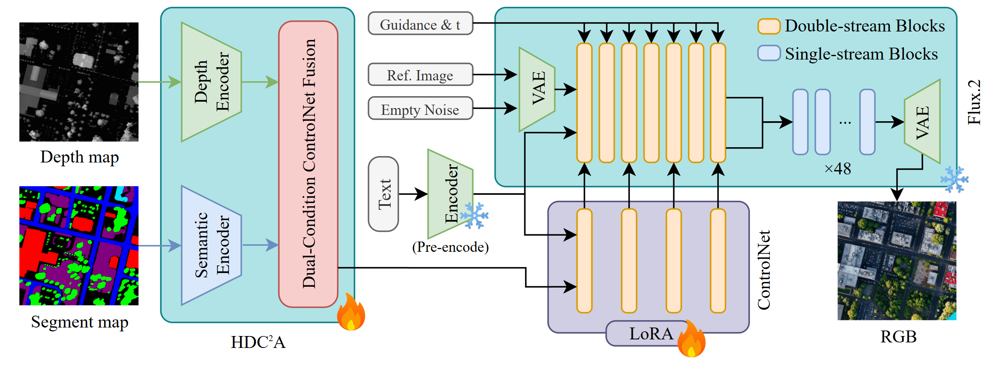

# HDC²A + Flux.2 ControlNet Training

Fine-tune a Flux.2 ControlNet with a custom **Heterogeneous Dual-Condition Adapter (HDC²A)** that generates RGB satellite images from segmentation + depth map pairs, conditioned on text embeddings.

<p align="center">
  
</p>

## Quick Start (4 Commands)

```bash
# 1. Clone & create .env
git clone https://github.com/HKUJasonJiang/SynthUrbanSAT.git
cd SynthUrbanSAT
cp .env.example .env          # fill in HF_TOKEN_READ, HF_TOKEN_WRITE, WANDB_API_KEY

# 2. One-click setup (installs env + downloads data & weights + smoke test)
bash setup.sh --test-both 0,1,2,3

# 3. Launch all 4 experiments (auto WandB + auto HF upload)
bash run.sh

# 4. Monitor
tmux ls                        # list running experiments
tmux attach -t exp1            # attach to exp1 (Ctrl-B D to detach)
watch -n 1 nvidia-smi          # GPU utilization
```

> `setup.sh` will print the GPU summary at the end (e.g. "8× NVIDIA A100 80GB"). If all checks are green, just `bash run.sh`.

### Single-GPU vs Multi-GPU

```bash
# Single GPU machine: run.sh will only launch experiments that fit
bash run.sh

# 8-GPU machine: run.sh launches all 4 experiments concurrently
bash run.sh
```

### Test Without Training

```bash
python train_script.py --test --name smoke_single --no-wandb
python train_script.py --test-data --name smoke_data --no-wandb
```

### Override Hyperparameters

```bash
python train_script.py --name custom_run --batch-size 3 --num-epochs 200 --lora-rank 256
python train_script.py --name custom_run --milestone-pct 5   # every 5% (default: 10%)
```

### Resume from Checkpoint

```bash
python train_script.py --name resumed_run --resume output/checkpoint_epoch_0010
```

---

## Experiments (8×A100 80GB)

All 4 experiments run concurrently via tmux on different GPUs:

| # | Name | GPUs | BS | Effective BS | Special |
|---|------|------|----|--------------|---------|
| 1 | `lora_baseline_4A100_main` | 0,1,2,3 | 12 | 48 | adapter_lr=8e-4 |
| 2 | `abl_seg_only_2A100` | 4,5 | 6 | 24 | `--disable-depth` |
| 3 | `lora_rank_256_1A100` | 6 | 3 | 12 | `--lora-rank 256` |
| 4 | `abl_time_1A100` | 7 | 3 | 12 | `--no-minsnr` |

### Exp 1: Main baseline, 4×A100

```bash
tmux new-session -d -s exp1 'cd ~/SynthUrbanSAT && CUDA_VISIBLE_DEVICES=0,1,2,3 ~/miniconda/envs/flux_train/bin/torchrun --nproc_per_node=4 --master_port=29500 train_script.py --name lora_baseline_4A100_main --batch-size 12 --adapter-lr 8e-4 --hf-repo JasonXF/SynthUrbanSAT-Output --seed 42'
```

### Exp 2: Seg-only ablation, 2×A100

```bash
tmux new-session -d -s exp2 'cd ~/SynthUrbanSAT && CUDA_VISIBLE_DEVICES=4,5 ~/miniconda/envs/flux_train/bin/torchrun --nproc_per_node=2 --master_port=29501 train_script.py --name abl_seg_only_2A100 --batch-size 6 --disable-depth --hf-repo JasonXF/SynthUrbanSAT-Output --seed 42'
```

### Exp 3: LoRA rank 256, 1×A100

```bash
tmux new-session -d -s exp3 'cd ~/SynthUrbanSAT && CUDA_VISIBLE_DEVICES=6 ~/miniconda/envs/flux_train/bin/python train_script.py --name lora_rank_256_1A100 --batch-size 3 --lora-rank 256 --hf-repo JasonXF/SynthUrbanSAT-Output --seed 42'
```

### Exp 4: Uniform timestep weight, 1×A100

```bash
tmux new-session -d -s exp4 'cd ~/SynthUrbanSAT && CUDA_VISIBLE_DEVICES=7 ~/miniconda/envs/flux_train/bin/python train_script.py --name abl_time_1A100 --batch-size 3 --no-minsnr --hf-repo JasonXF/SynthUrbanSAT-Output --seed 42'
```

### GPU VRAM Reference

| VRAM (GiB) | Recommended batch_size | Notes |
|---|---:|---|
| 80 (A100) | 3 | 72488 MiB |
| 96 (H100) | 4 | 88 GiB used |
| 140 (H200) | 8 | ~126 / 144 GiB used |

> If OOM, reduce `--batch-size` first; keep effective batch size via higher `--grad-accum-steps`.

---

## Overview

| Component | Status | Params |
|-----------|--------|--------|
| Flux.2 Transformer backbone | Frozen (FP8) | ~32B |
| ControlNet control blocks + LoRA | **Trainable** | ~4.1B + 9.8M |
| HDC²A Adapter | **Trainable** | 52.4M |

- **Input**: segmentation map + depth map + text prompt
- **Output**: photorealistic satellite RGB image (512×512)
- **Loss**: flow matching (velocity prediction) with min-SNR weighting
- **LoRA**: ON by default (rank=32); disable with `--no-lora`

---

## Project Structure

```
├── run.sh              ← Launch all 4 experiments in tmux (one click)
├── setup.sh            ← One-click environment setup
├── train_script.py     ← Training entry point
├── scripts/            ← Training modules (models, data, utils)
├── docs/
│   ├── setup_server.md     ← Server deployment, tmux workflow, multi-GPU details
│   └── ARCHITECTURE.md     ← Detailed architecture & tensor shapes
└── output/             ← Checkpoints & logs
```

---

## Documentation

| Doc | Description |
|-----|-------------|
| **[Server Setup & Multi-GPU Guide](docs/setup_server.md)** | Full server deployment, DDP experiments, tmux workflow, HF upload |
| **[Architecture Details](docs/ARCHITECTURE.md)** | HDC²A internals, tensor dimensions, VRAM profiling, model loading sequence |
