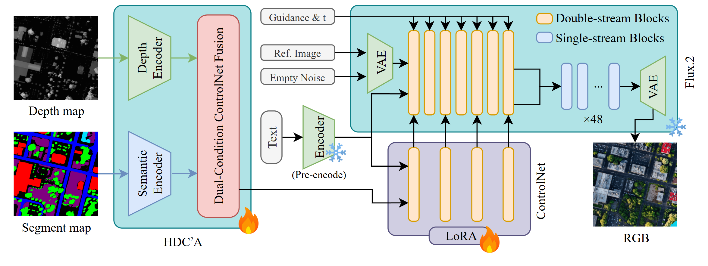

# Train Pipeline: HDC2A + FLUX.2 ControlNet LoRA

This pipeline trains the conditional image generation model used by SynthUrbanSAT. It fine-tunes a FLUX.2-dev ControlNet with LoRA and a Heterogeneous Dual-Condition Adapter (HDC2A), mapping paired segmentation and depth maps to realistic satellite RGB images.

The current training data target is US3D-style aligned triplets:

```text
segmentation map + depth map + text prompt -> satellite RGB
```

The trained checkpoint is later consumed by `../generation_pipeline` to turn OSM-derived `seg + depth` products into pseudo-realistic satellite imagery.

<p align="center">
  
</p>

## Quick Start

```bash
cd train_pipeline
cp .env.example .env
# Fill in HF_TOKEN_READ, optional HF_TOKEN_WRITE, and optional WANDB_API_KEY.

bash setup.sh --test-both 0,1,2,3
bash run.sh
```

`setup.sh` creates or reuses the `flux_train` conda environment, downloads the US3D training dataset and model weights, then runs a smoke test unless disabled.

## Environment Variables

Create `.env` from `.env.example`:

```bash
HF_TOKEN_READ=hf_xxx
HF_TOKEN_WRITE=hf_xxx
WANDB_API_KEY=xxx
```

`HF_TOKEN_READ` is required for private HuggingFace datasets or weights. `HF_TOKEN_WRITE` and `WANDB_API_KEY` are only needed when pushing outputs or logging experiments.

## Common Commands

```bash
# Single-process smoke test
python train_script.py --test --name smoke_single --no-wandb

# Dataset + one-step smoke test
python train_script.py --test-data --name smoke_data --no-wandb

# Single-GPU training
python train_script.py --name custom_run --batch-size 3 --num-epochs 200 --lora-rank 256

# Multi-GPU DDP training
torchrun --nproc_per_node=4 train_script.py --name hdc2a_flux2_main --batch-size 12 --seed 42

# Resume
python train_script.py --name resumed_run --resume output/checkpoint_epoch_0010
```

## Experiments

`run.sh` launches the main training and ablation experiments with tmux. The default plan targets an 8xA100/H100/H200-class server.

| Experiment | GPUs | Purpose |
| --- | ---: | --- |
| Main HDC2A + LoRA | 4 | Full segmentation + depth conditioning |
| Seg-only ablation | 2 | Remove depth control |
| Higher LoRA rank | 1 | LoRA capacity ablation |
| Timestep weighting ablation | 1 | Disable min-SNR weighting |

If you hit OOM, reduce `--batch-size` first and recover effective batch size with gradient accumulation.

## Outputs

Training writes checkpoints, logs, and visualizations under `output/`. The directory is ignored by Git. Publish selected checkpoints to HuggingFace instead of committing them to the repository.

## Structure

```text
train_pipeline/
├── train_script.py
├── train_script_ablation_a.py
├── train_script_ablation_b.py
├── train_script_ablation_c.py
├── run.sh
├── setup.sh
├── environment.yml
├── requirements.txt
├── configs/
├── docs/
├── models/
└── scripts/
```

## Documentation

- [docs/ARCHITECTURE.md](docs/ARCHITECTURE.md): HDC2A internals, tensor shapes, model loading, and VRAM notes.
- [docs/setup_server.md](docs/setup_server.md): server setup, DDP, tmux workflow, and HuggingFace upload notes.
